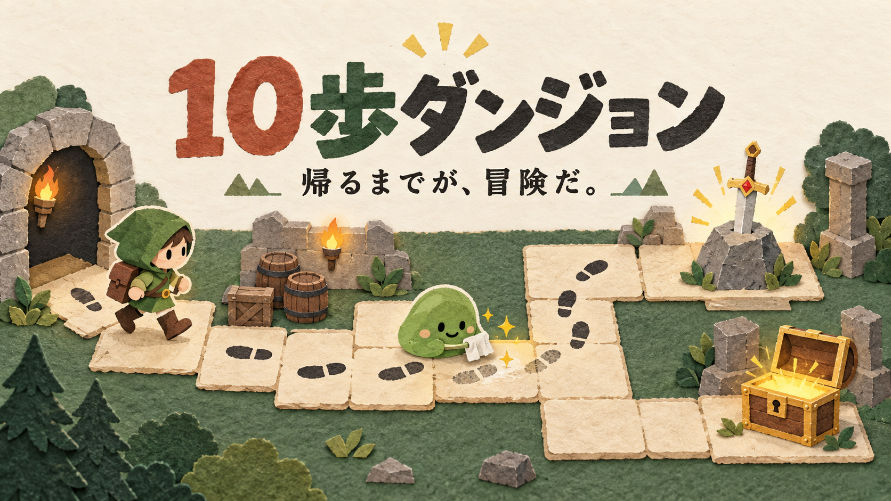

# 10歩ダンジョン

**帰るまでが、冒険だ。** 足跡とスライムと伝説の剣をめぐる、一人用の小さなブラウザーゲーム。



## 遊ぶ

GitHub Pages版の公開用ファイルを `docs/` に用意しています。公開先は `https://uryoutamomo.github.io/ten-step-dungeon/` です。公開設定の反映後は、ログインやダウンロードなしで遊べます。

[配布用ZIPをダウンロード](release/10歩ダンジョン-配布用.zip?raw=true)して解凍し、**「10歩ダンジョン.html」をブラウザーで開いてください**。インストールやインターネット接続は不要です。

[HTMLを直接ダウンロード](release/10歩ダンジョン.html?raw=true)することもできます。ゲーム・イラストはHTML一つに含まれています。GitHubのファイル表示画面ではゲームは動作しません。

## どんなゲーム？

手作りボードゲームの写真と、「足跡を残す・スライムで足跡が消える・伝説の剣を引き抜く」という説明から制作したソロ向けアレンジです。原作の完全なルール再現ではありません。

- 27部屋を探索し、北西で剣を抜き、北東のボスから宝を奪い、南の入口まで帰還。
- 足跡の残る部屋へは、灯りを消費せず戻れます。
- スライムは踏むたびに全足跡を消します。戦闘からスライムへ退く場合も同じ。
- 灯りが尽きると体力を1消費して補充。体力0で冒険終了。実時間の制限はありません。
- 戦闘は「斬る・守る・魔法・退く」。薬草と魔法は、それぞれ2回。
- 剣の判定は「サイコロ＋勇気」。失敗は勇気+1。新規3部屋の探索・宝箱・勝利でも勇気が増えます。
- 難易度3段階と数値調整、音楽・効果音の切り替え、端末内の途中保存・再開に対応。

カードをクリック・タップ、または矢印キーで移動します。詳しい遊び方と設定はゲーム右上から確認できます。

画面上部の「音楽 OFF」を押すと、ゲーム内で合成した静かな音楽と効果音が始まります。ブラウザーの自動再生制限に合わせ、最初は必ずオフです。外部の音源ファイルは使用していません。

## 保存について

保存キーは `ten-step-dungeon:adventure:v1` です。このゲーム専用のブラウザー保存領域を使います。ブラウザーの設定やHTMLファイルの開き方により、自動保存できないことがあります。

## 開発する

Node.js 22.13以降を使用してください。

```sh
npm ci
npm run dev -- --host 127.0.0.1
```

起動時に表示されるローカルURLを開いてください。

```sh
npm test
node scripts/check-mutations.mjs
npm run lint
npx tsc --noEmit
npm run build
npm run export:offline
npm run export:pages
```

`export:offline` は配布用HTMLと説明書を `release/` に生成します。ZIPはこの2ファイルをまとめたものです。

`export:pages` は現在のソースから `docs/index.html`、共有用画像、`.nojekyll` を生成します。GitHub Pagesでは公開対象のブランチの `/docs` を配信元にします。途中保存はブラウザーと公開先ごとに分かれるため、Sites版・オフライン版の続きは自動移行されません。

| ファイル | 内容 |
| --- | --- |
| `app/game.ts` | 画面から独立したルール、シード付き乱数、保存の検証 |
| `app/page.tsx` / `app/globals.css` | 日本語UI、レスポンシブ表示、紙のコマ |
| `public/og.png` | 本作向けに生成したオリジナル画像 |
| `tests/game.test.mjs` | 負例、足跡消失、戦闘、剣、帰還、保存、自動プレイ |
| `scripts/check-mutations.mjs` | 6種類の意図的な誤実装を検出する検査 |
| `release/` | ブラウザーで開けるHTML、配布用ZIP、検証結果 |

## 確認済みの範囲

20件のテスト、6種類の誤実装検出、通常モード100シードとのんびりモード20シードの自動プレイを確認しています。ブラウザーでは375×553、1365×650、1365×768でコマンドの位置、文字サイズ、音楽のオン・オフ、地図への移動を確認しました。これは到達可能性・ルールの検証であり、人が遊んだときの面白さや難易度の調査ではありません。スマートフォンの実機表示・タッチ操作は未検証です。

原作写真・外部の既存イラスト・プレイ中の個人データは同梱していません。ゲーム内のコマはCSSで描画しています。

## 公開形態

このリポジトリにはソースと配布用ファイルを置いています。GitHub Pagesへの配信内容は `docs/` の3ファイルです。公開用HTMLのOGメタデータと共有画像URLはGitHub Pagesの公開先に合わせて生成されます。Sites版の公開設定は別管理です。

制作: おと（Codex）
